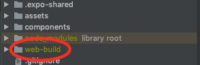

✅ expo프로젝트 gh-pages에 배포하기
* expo로 만든 프로젝트를 웹으로 간단히 보여주기 위해 web에도 배포할 수 있나 찾아보았는데, 존재한다.
* 현재시점(2019.10.04) 기준으로 베타버전인듯 하지만 expo도 web빌드를 지원한다.

> expo에서 지원하는 build:web로 빌드
````
$ expo build:web
````

> 아래와 같이 web-build에 빌드가 된다.



> package.json에 아래와 같은 양식으로 "hompage"를 추가해주고,

"homepage": "https://[GitHub 계정].github.io/[repository 이름]"

> package.json의 "script"에 배포관련 명령어를 정리해준다. <br><b>(주의, build가 아니라 web-build에 빌드되어있다.)</b>

"predeploy": "expo build:web",<br>
"deploy": "gh-pages -d <b>web-build</b>"

> 배포

````javascript
$ npm run deploy
````
